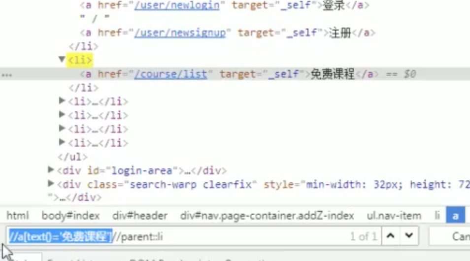

### xpath的学习

[TOC]

#### 1.相对路径，绝对路径

##### 1.1 绝对路径

> 绝对路径以 / 开始，由于过于固定，当网站稍有变化时就容易失效，所以不常使用
>
> / 表示的是直接子节点

​		/html/body/div[4]/div/div[3]/div[1]/div[2]/div[4]/div/a

##### 1.2 相对路径

> 相对路径以 // 开始，日常使用较多
>
> // 表示的是子节点以及孙节点，孙孙节点等等

​		//*[@id="main"]/div/div[3]/div[1]/div[2]//a

#### 2.如何构建一个有效的Xpath

##### 2.1 使用text()构建

> **目的**： 定位 忘记密码 的链接位置	
>
> **使用**： //a[text()='忘记密码']

##### 2.2 使用Contains关键字构建

> **语法**：
>
> //tag[contains(@attr, 'value')]
>
> **例如**： 
>
> //a[text(), '忘记密码']
>
> //input[contains(@class, 'ipt') and contains(@placeholder, '手机号')]

##### 2.3 使用starts-with关键字构建

> **语法**：
>
> //tag[starts-with(@attr, 'value')]

#### 3.如何查找父节点和平级节点

> **使用场景**：
>
> 当一个节点没有一些特殊属性的时候，很难单独定位出来。此时先找到*容易定位*的节点，然后通过父节点兄弟节点来相对定位到 刚才那个难以定位的节点。
>
> **父节点语法** ：
>
> Xpath-of-element//parent::tag
>
> **兄弟节点语法** ：
>
> **前面所有兄弟节点** ：xpath-of-element//preceding-sibling::tag
>
> **后面所有兄弟节点** ：xpath-of-element//following-sibling::tag

比如，要获取到 ‘免费课程’ 的父节点，可以使用如下xpath:

//a[text()='免费课程']//parent::li

#### 4.实践出真知，出手吧少年

#### 5.常见的面试题

##### 5.1 绝对路径与相对路径的区别

##### 5.2 / 与 // 之间的区别

##### 5.3 有什么不同的方法写xpath?哪一种查找最快？

