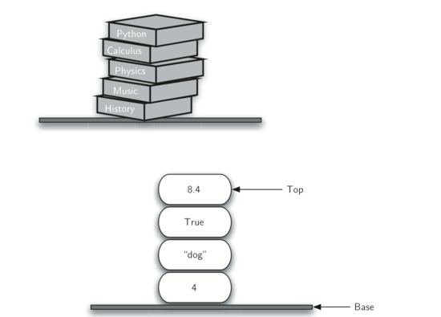
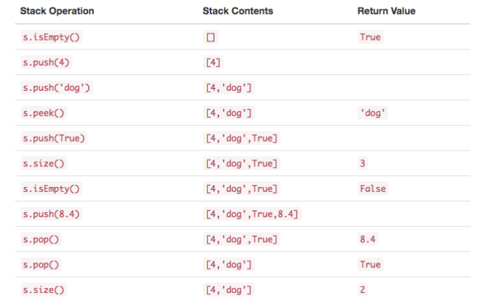

### 数据结构之一栈

> 栈，是一个项的有序集合，其中添加移除都发生在同一端。**先进后出**
>
> 为了便于理解，想象桌面上的一堆书
>
> Android每次新开一个页面，也是新入栈
>
> 

##### 使用python 实现栈结构

- 定义栈的抽象数据类型

  - 结构
    - 栈被构造为项的有序集合，其中项被添加和从末端移除的位置称为“顶部”。栈是有序的 LIFO 
  - 操作
    - Stack() 创建一个空的新栈。 它不需要参数，并返回一个空栈。
    - push(item)将一个新项添加到栈的顶部。它需要 item 做参数并不返回任何内容。
    - pop() 从栈中删除顶部项。它不需要参数并返回 item 。栈被修改。
    - peek() 从栈返回顶部项，但不会删除它。不需要参数。 不修改栈。
    - isEmpty() 测试栈是否为空。不需要参数，并返回布尔值。
    - size() 返回栈中的 item 数量。不需要参数，并返回一个整数。
    - 

- 具体实现

  > 现在我们已经将栈清楚地定义了抽象数据类型，我们将把注意力转向使用 Python 实现栈。回想一下，当我们给抽象数据类型一个物理实现时，我们将实现称为数据结构。
  >
  > 在 Python 中，与任何面向对象编程语言一样，抽象数据类型（如栈）的选择的实现是创建一个新类。栈操作实现为类的方法。此外，为了实现作为元素集合的栈，使用由 Python 提供的原语集合的能力是有意义的。 我们将使用***列表***作为底层实现

  - 代码

    ```python
    
    ```

    

