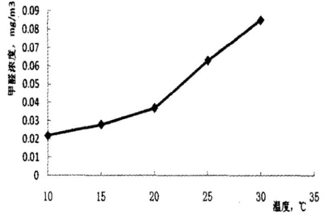
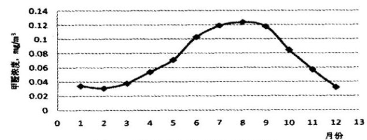

### 甲醛科普向之一

- 是什么
- 来源
- 特性是什么
- 什么危害
- 怎么监测
- 怎么处理

#### 是什么

 甲醛无色无味，实际上我们问到的刺激性气味一般是苯，甲醛容易溶解在水里，而且溶解在水里有另外一个名字，叫做福尔马林，对，你没有看错，就是你知道的那个福尔马林。

你可能不知道的几件事：

-  大量化工产品，都要用到甲醛以及其衍生品，从橡胶到塑料，再到服装，甚至啤酒、水果保鲜等饮食行业，生活中几乎无处不在; 
-  纯天然的东西，比如天然原木，也会有少量甲醛 。所以说，抛开剂量谈毒性都是耍流氓。
-  甲醛最主要的源头是**胶水**（着重强调），主要成分叫做“脲醛树脂” ， 是尿素与甲醛在催化剂(碱性或酸性催化剂)作用下生成的，但是加工反应过程中，有未完全反应的，就变成“游离甲醛”慢慢的 释放出来。
- 室内空气的三大杀手：甲醛、VOC(也就是空气中的挥发有机物，包含苯等)、PM2.5； 行业有句话叫无醛不成胶、无苯不成漆，也就是说甲醛主要在胶中，苯主要在油漆中； 
- 国家标准
  - 室内甲醛： 关闭门窗1个小时，甲醛含量≤0.08mg/m³算达标。 
  - 板材标准： 请注意国家只有E1标准，没有E0，E0都是未经监管的，不要被噱头欺骗了。

#### 主要来源

-  人造板
  -  目前，一些人造板(如复合地板、胶合板、细木工板等)在生产过程中，使用了以甲醛为主要成分的脲醛树脂作为粘胶剂。 
-   油漆（水性油漆和木蜡油会好一些，最差的是油性油漆含有大量的苯、甲醛）、胶粘剂 
  -  白乳胶、泡沫塑料、油漆和涂料等也含有甲醛。乳胶胶粘剂在装饰装修中广泛用于木器工程和墙面处理方面，特别是封闭在墙面乳胶中的甲醛很难清除 
-  纺织品 
  -  (包括床上用品、墙布、墙纸、化纤地毯等)在生产中，为了增加抗皱性能、防水性能、防火性能，常加入一些含有甲醛的助剂，在使用时会释放出甲醛 。特别是贴墙纸需要使用大量的胶水，更是给屋内的空气雪上加霜。

#### 危害

- 新装修的房间甲醛含量较高，并且甲醛的释放周期一般在3-10年左右，是众多疾病的主要诱因，最常见的就是白血病。因为2018年的自如事件，让很多人对甲醛重视起来，甲醛与白血病的关系被无限放大了，很多人非常恐惧。

-  **甲醛对于遗传变异，也是有影响的**。 

- 甲醛的危害到底有多大，要看四个问题：

  一是甲醛超标多少，一般来说超标0.15以下的是轻微的超标，如果预算有限的话可以不用除甲醛，保持良好通风，房间不要长时间密闭，超过这个数值的要重视一下，国家标准是0.08.

  二是看人群，儿童、孕妇、老人、免疫力低下者对甲醛更为敏感一些，这些人群建议必须在0.1以下的安全环境，尤其是儿童，因为甲醛挥发以后，密度比空气的密度大，自然状态下是下沉的，离地面越低甲醛相对浓度更高一些，同一个空间里，对儿童危害更大；

  三是看检测时的温度，冬天室内没有暖气低于19度的情况下，检测的数值会低很多，夏天没开空调超过28度的情况下，检测数值会高很多，一般建议在24-25度的标准人居环境中检测来看；

  四是看装修材质，材质的好坏决定了甲醛挥发多少和挥发周期，所有合成类板材，比如压缩板、大芯板、颗粒板等甲醛含量都不会低且挥发周期很长，实木类的板材也有甲醛，但是含量小挥发快。

  综上所述，家中有儿童、孕妇的，建议一定要甲醛达国标以下。

#### 特性

-  **甲醛在什么条件下释放的更快** 

  - 结论是，温度越高，甲醛挥发越快，湿度越高，甲醛同样挥发越快；

    但是区别是，**甲醛随着温度升高，挥发量呈类指数增长**， 随着湿度的升高，呈类线性增长 。

    甲醛从19度开始加速挥发，19度以下挥发很少，10度以下基本不挥发了，超过28度以后挥发达到正常5-10倍以上的速度，所以国标里限定了检测的最高温度不能超过28度，建议是24-25度，甲醛从19度开始，温度每上升一度，挥发速度都会同步加快 。

    

  -  就是一年中，居室中甲醛超标更多集中以下几月，可以看到就是温度较高的夏季。

    

-  **甲醛能释放多久** 

  -  甲醛在20～30天后，进入比较稳定的释放周期，一直持续到6个月后，都还有比较稳定的释放，所以为什么说新房装修要通风控制6个月，因为前6个月是甲醛释放的**喷发期**。