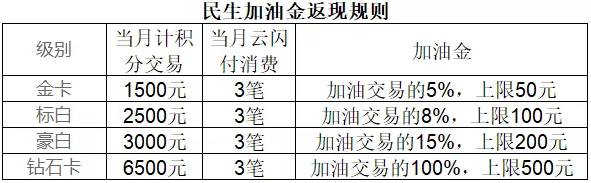
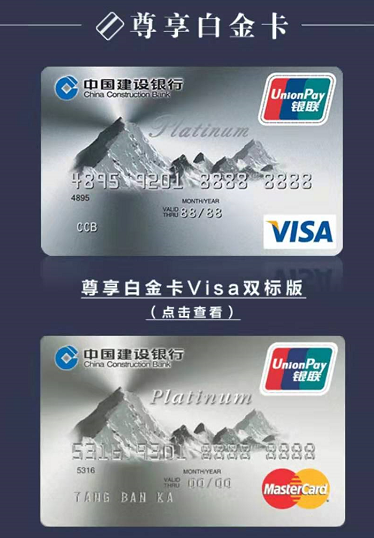

##### 广发

- 犀利卡（新户必办）
- 国寿奕驾
- 国寿奕购

------

##### 工行

- plus版光芒女性卡
- 香白（免年费）

------

##### 交通

- 沃尔玛卡

------

##### 平安

- 旅游白金卡
- 腾讯视频
- 爱奇艺
- 优酷

------

##### 民生

- 精英白（新户必办, 下卡额度5-15万，新户首年免年费，次年起用20万积分兑换年费，送900积点 ）

- 车车白( 薅加油金很容易，只要是加油类商户(MCC为5541和5542)反复摩擦即可获得返现 )

  

- 香格里拉白（标白120:1， 豪白60:1, 标白刷18次可免，豪白刚性收割3600元； ）

- 女人花

------

##### 招行

- 经典白
- Young

------

##### 中信

- 淘宝V卡

------

##### 建行

- 航空白金卡（南海东国换里程，年费刷免）

   小白金，买买买10笔免年费，懒人必备躺赚航空里程，南航和海航白金卡14比1兑换里程，东航和国航12比1兑换里程。 

  额度1W起

- 尊享白（又称大山白，8W起步）

  

  主卡40W积分兑换年费，附属卡20W积分兑换。

  权益多多：

  1.  豪华酒店

     可享贵宾价入住2间夜指定酒店权益。
     高端星级酒店尊享贵宾价“200元+1000积分”入住 

  2. 航空商旅服务

      享3次境内机场/高铁接送机服务 

      享6次境内单程50公里以内免费代驾服务 

      全年3次免费享受全球PriorityPass指定国际机场贵宾厅服务 

      全年不限次数享受40余家建行指定国内机场贵宾厅服务 

  3. 医院挂号服务

      全国一线城市三甲医院专家门诊预约服务，持卡人本人及2名亲属（共三人）共同享用，全年无次数限制。 

      全年3次一对一的全程导诊服务，持卡人本人及2名亲属（共三人）共同享用。 

  4. 双倍积分

> 4）忌总授信过高。总授信是银行根据个人资质、征信报告等评估出来的一个授信额度。每家银行对一个人的评估结果都可能不一样，可以通过搬砖、资质进件来提高总授信。
>
> 5）不粘人。风控不严，骚扰电话少，不像广发平安天天分期，保险来烦人。
>
> 6）羊毛少。没有特色活动，主要是一些境外返现活动，我等凡人很难薅。
>
> 7）临时有毒。千万不要使用零额，只能看看，不要动手，否则......后果很严重。
>
> 8）提额难，额度低。建行比较谨慎，平均下卡额度偏低。

 建行快贷 

 快贷属于贷款，审批过后一年有效，最高30w，循环使用，可随借随还和分期偿还，年息低至4.3%，都是给优质客户的周转神器，谁用谁知道。建行快贷也是我们选择建行的原因。

保底额度

 芭比白2w起，尊享白8w起。推倒有保底额度的卡，额度步步高不是梦。 

------

