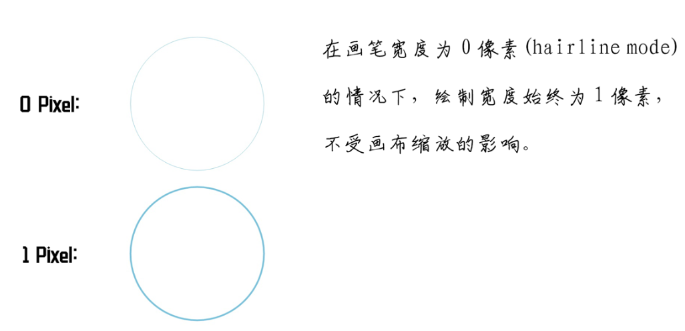
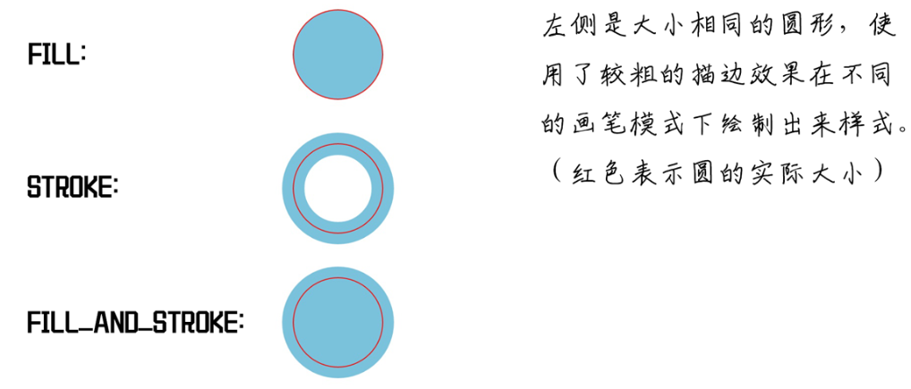

#### 自定义View基础第三式——画笔Paint

[TOC]


##### 第一、引子概述

View上的内容是通过Canvas绘制出来的，但是Canvas中的大多数绘制方法都需要Paint作为参数。例如 `canvas.drawCircle(100,100,50,paint)` ，最后需要传递一个Paint,这是为什么呢？

因为画布本身只是呈现的一个载体，真正绘制出来的效果却要取决于画笔，就像同样白纸，要绘制一幅山水图，用毛笔画和用铅笔画的效果肯定是完全不同的，决定不同显示效果的并不是画布(Canvas), 而是画笔(Paint)。

 同样，在程序设计中也采用的类似的设计思想，画布的 draw 方法只是规定了所需要绘制的是什么东西，但具体绘制出什么效果则通过画笔来控制。
例如： `canvas.drawCircle(100, 100, 50, paint)`，这个方法说明了要在坐标 (100, 100) 的位置绘制一个半径为 50 的圆，但是这个圆具体要绘制成什么样子却没有明确的表明，圆的颜色，圆环还是圆饼等都没有明确的指示，而这些内容正存在于画笔之中。 

##### 第二、画笔介绍

###### 	2.1、初始化

 要使用画笔就要会创建画笔，创建一个画笔是非常简单的，在之前的文章中也有过简单的介绍。它有三种创建方法，如下： 

```java
// 1.创建一个默认画笔，使用默认的配置
Paint()
// 2.创建一个新画笔，并通过 flags 参数进行配置。
Paint(int flags)
    // 如果需要设置多个参数，参数之间用 | 进行连接即可
	Paint paint = new Paint(Paint.ANTI_ALIAS_FLAG | Paint.DITHER_FLAG); 
// 3.创建一个新画笔，并复制参数中画笔的设置。就是复制一个画笔
Paint(Paint paint)
```

**不建议使用setFlags方法，这是因为 setFlags 方法会覆盖之前设置的内容** ，例如：

```java
Paint paint = new Paint();
paint.setFlags(Paint.ANTI_ALIAS_FLAG);
paint.setFlags(Paint.DITHER_FLAG);
Log.i(TAG, "paint isAntiAlias = " + paint.isAntiAlias());
Log.i(TAG, "paint isDither = " + paint.isDither());
```

输出结果：

```java
paint isAntiAlias = false
paint isDither = true
// 如果想要调整 flag 个人建议还是使用 paint 提供的一些封装方法，如:
 paint.setDither(true)
// 而不要自己手动去直接操作 flag。
```


###### 	2.2、画笔颜色

```java
// 下面两种设置方式是等价的，一种是 10 进制，一种是 16 进制
paint1.setAlpha(204);
paint2.setAlpha(0xCC);
// setARGB(), 4个参数的取值范围也是 0 - 255，对应 0x00 - 0xFF
paint1.setARGB(204, 255, 255, 0);
paint2.setARGB(0xCC, 0xFF, 0xFF, 0x00);
// setColor()
paint.setColor(Color.GREEN);
paint.setColor(0xFFE2A588);
```

**注意：**

 如果不设置 Alpha 通道，则默认Alpha通道为 0，即完全透明，如：0xE2A588，总共 6 位，没有 Alpha 通道，如果这样设置，则什么颜色也绘制不出来。 

###### 2.3、画笔宽度

```java
// 将画笔设置为描边
paint.setStyle(Paint.Style.STROKE);
// 设置线条宽度
paint.setStrokeWidth(120);
```

**注意：**

 **这条线的宽度是同时向两边进行扩展的，例如绘制一个圆时，将其宽度设置为 120 则会向外扩展 60 ，向内缩进 60，如下图所示。** 


 **因此如果绘制的内容比较靠近视图边缘，使用了比较粗的描边的情况下，一定要注意和边缘保持一定距离(`边距>StrokeWidth/2`) 以保证内容不会被剪裁掉。** 

**发际线模式 hairline mode**:

 在画笔宽度为 0 的情况下，使用 drawLine 或者使用描边模式(STROKE)也可以绘制出内容。只是绘制出的内容始终是 1 像素，不受画布缩放的影响。该模式被称为**hairline mode (发际线模式)**。 

>  如果你设置了画笔宽度为 1 像素，那么如果画布放大到 2 倍，1 像素会变成 2 像素。但如果是 0 像素，那么不论画布如何缩放，绘制出来的宽度依旧为 1 像素。 

```java
// 缩放 5 倍
canvas.scale(5, 5, 500, 500);

// 0 像素 (Hairline Mode)
paint.setStrokeWidth(0);
paint.setColor(0xFF7FC2D8);
canvas.drawCircle(500, 455, 40, paint);

// 1 像素
paint.setStrokeWidth(1);
paint.setColor(0xFF7FC2D8);
canvas.drawCircle(500, 545, 40, paint);
```




###### 2.4、画笔模式

```java
//填充
mPaint.setStyle(Paint.Style.FILL);
// 描边
mPaint.setStyle(Paint.Style.STROKE);
// 描边+填充
mPaint.setStyle(Paint.Style.FILL_AND_STROKE);
```

**示例程序：**

用一个简单的例子说明一下不同模式的区别。

```java
// 画笔初始设置
Paint paint = new Paint();
paint.setAntiAlias(true);
paint.setStrokeWidth(50);
paint.setColor(0xFF7FC2D8);

// 填充，默认
paint.setStyle(Paint.Style.FILL);
canvas.drawCircle(500, 200, 100, paint);

// 描边
paint.setStyle(Paint.Style.STROKE);
canvas.drawCircle(500, 500, 100, paint);

// 描边 + 填充
paint.setStyle(Paint.Style.FILL_AND_STROKE);
canvas.drawCircle(500, 800, 100, paint);
```




###### 2.5、画笔线段线帽(Paint.Cap，3种)

###### 2.6、线段连接方式(拐角类型Paint.Join， 3种)

###### 2.7、pathEffect(6种PathEffect，其中4种基础效果，2种叠加效果)

###### 2.8、getFillPath()

