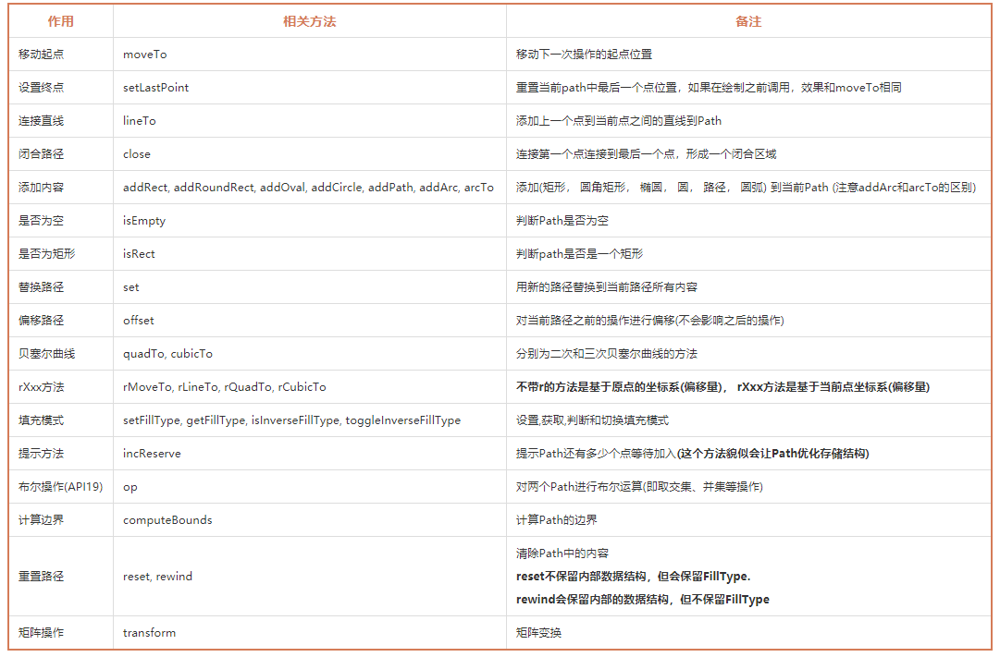
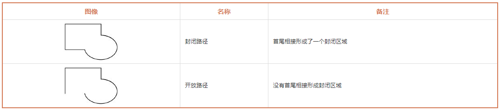
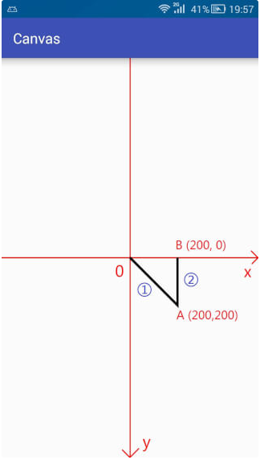
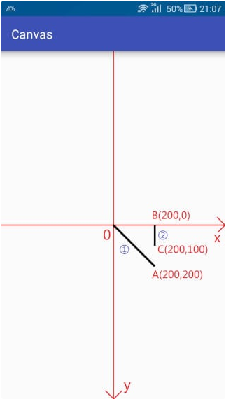
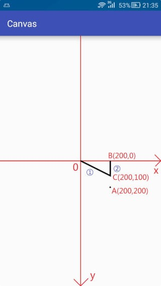

### 自定义View第八式——Path之基本操作

[TOC]


#### 第一、Path常用方法表

>  为了兼容性(*偷懒*) 本表格中去除了部分API21(即安卓版本5.0)以上才添加的方法。 




#### 第二、Path详解

**请关闭硬件加速，以免引起不必要的问题！
请关闭硬件加速，以免引起不必要的问题！
请关闭硬件加速，以免引起不必要的问题！** 

 **在AndroidMainfest文件中application节点下添上 android:hardwareAccelerated=”false”以关闭整个应用的硬件加速。** 

##### 2.1、Path的作用

前面我们讲解的所有绘制都是简单的几何图形（线、圆、矩形、弧形）等，而对于那些复杂的图形却没法绘制（心形、五角星）等，而 **使用Path不仅能够绘制简单图形，也能绘制复杂图形，另外，根据路径绘制文本，剪裁画布都需要使用到Path**


##### 2.2、Path的含义

Path封装了由直线和曲线（二次、三次贝塞尔曲线）构成的几何路径。

 另外路径有开放和封闭的区别 。




##### 2.3、Path使用方法详解

###### 2.3.1、moveTo、 setLastPoint、 lineTo 和 close

 按照惯例，先创建画笔： 

```java
Paint mPaint = new Paint();             // 创建画笔
mPaint.setColor(Color.BLACK);           // 画笔颜色 - 黑色
mPaint.setStyle(Paint.Style.STROKE);    // 填充模式 - 描边
mPaint.setStrokeWidth(10);              // 边框宽度 - 10
```

*lineTo*:

```java
public void lineTo (float x, float y)
```

 那么我们就来试一下： 

```java
canvas.translate(mWidth / 2, mHeight / 2);  // 移动坐标系到屏幕中心(宽高数据在onSizeChanged中获取)

Path path = new Path();                     // 创建Path

path.lineTo(200, 200);                      // lineTo
path.lineTo(200,0);

canvas.drawPath(path, mPaint);              // 绘制Path
```



*moveTo和setLastPoint:*

```java
// moveTo
public void moveTo (float x, float y)

// setLastPoint
public void setLastPoint (float dx, float dy)
```

**注意：** moveTo不影响之前的操作，setLastPoint影响之前的操作

```java
canvas.translate(mWidth / 2, mHeight / 2);  // 移动坐标系到屏幕中心

Path path = new Path();                     // 创建Path

path.lineTo(200, 200);                      // lineTo

path.moveTo(200,100);                       // moveTo

path.lineTo(200,0);                         // lineTo

canvas.drawPath(path, mPaint);              // 绘制Path
```



 下面是setLastPoint的示例： 

```java
canvas.translate(mWidth / 2, mHeight / 2);  // 移动坐标系到屏幕中心

Path path = new Path();                     // 创建Path

path.lineTo(200, 200);                      // lineTo

path.setLastPoint(200,100);                 // setLastPoint

path.lineTo(200,0);                         // lineTo

canvas.drawPath(path, mPaint);              // 绘制Path
```



**setLastPoint是重置上一次操作的最后一个点，在执行完第一次的lineTo的时候，最后一个点是A(200,200),而setLastPoint更改最后一个点为C(200,100),所以在实际执行的时候，第一次的lineTo就不是从原点O到A(200,200)的连线了，而变成了从原点O到C(200,100)之间的连线了。**

**在执行完第一次lineTo和setLastPoint后，最后一个点的位置是C(200,100),所以在第二次调用lineTo的时候就是C(200,100) 到 B(200,0) 之间的连线(用蓝色圈2标注)。**


###### 2.3.2、addXxx与arcTo


###### 2.3.3、isEmpty、 isRect、isConvex、 set 和 offset

#### 第三、总结与栗子