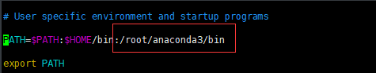
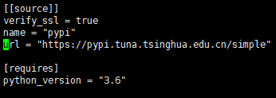

#### 配置owllook网站

- 安装mongo

  ```shell
  vim /etc/yum.repos.d/mongodb-org-4.0.repo
  # 填入以下内容
  [mongodb-org-4.0]
  name=MongoDB Repository
  baseurl=https://repo.mongodb.org/yum/redhat/$releasever/mongodb-org/4.0/x86_64/
  gpgcheck=1
  enabled=1
  gpgkey=https://www.mongodb.org/static/pgp/server-4.0.asc
  
  # 验证
  yum repolist
  # 可以看到mongodb的repo已经存在
  ```

  

  ```shell
  # 安装
  yum install -y mongodb-org
  # 启动
  systemctl start mongod
  # 验证，查看状态 active(running)
  systemctl status mongod
  ```

- 下载代码

  ```shell
  git clone https://github.com/howie6879/owllook
  # 搭建python3.6环境
  
  # 下载anaconda管理python环境
  wget https://mirrors.tuna.tsinghua.edu.cn/anaconda/archive/Anaconda3-5.3.0-Linux-x86_64.sh
  # 安装
  bash Anaconda3-5.0.1-Linux-x86_64.sh
  #后面一直选yes就行了
  # 加入环境变量，执行 vim ~/.bash_profile 修改文件中 PATH 一行，将 /root/anaconda3/bin 
  # 加入到PATH=$PATH:$HOME/bin 一行之后（注意以冒号分隔），
  
  ```

  

  ```shell
  source ~/.bash_profile
  # 激活环境
  source ~/.bashrc
  # 创建python3.6环境
  conda create -n python36 python=3.6
  ```

- 配置项目

  ```shell
  cd owllook
  # 安装pipenv
  pip install pipenv
  # 请先提前创建好Python3.6环境
  # 先修改Pipfile的url,改成清华的 https://pypi.tuna.tsinghua.edu.cn/simple
  vim Pipfile
  
  ```

  

  ```shell
  pipenv install --python ~/anaconda3/envs/python36/bin/python3.6
  # 安装依赖
  pipenv install
  # 激活环境
  pipenv shell
  # 运行owllook
  cd owllook
  python run.py
  
  # 注意run.py 需要修改内容
  mode 修改为 DEV
  gunicorn.py 改为 dev_gunicorn.py
  # dev_config.py中可以配置redis的密码
  ```

  